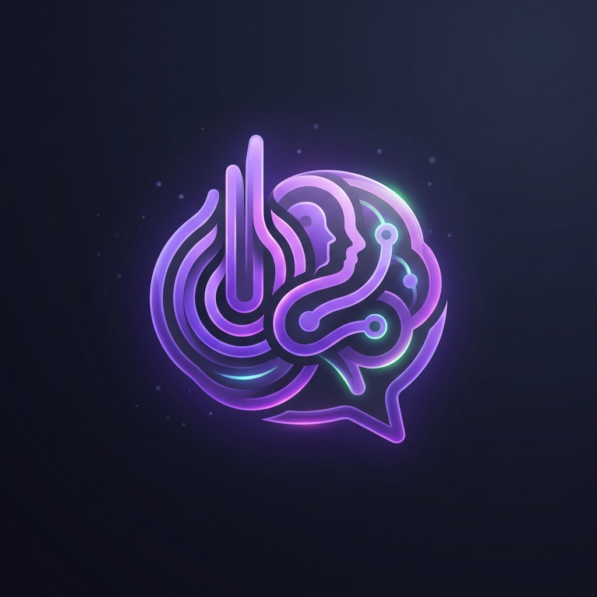

<div align="center">
  
  <h1>MeetingMind 🧠</h1>
</div>

Aplicación de escritorio inteligente para transcripción de reuniones en tiempo real y generación automática de notas técnicas. Emplea modelos locales o en la nube para transcripción y extracción de contexto.

---

## Características

- **Transcripción Dual**: Ejecuta reconocimiento de voz de manera 100% local (Vía `@xenova/transformers` + Whisper ONNX) o a máxima velocidad a través de la API en la nube de OpenAI Whisper.
- **Micro y Sistema Separados**: Transcripción en vivo del micrófono y del audio del sistema simultáneamente.
- **Soporte Multi-IA para Notas**: Generación de apuntes conectando con Ollama (local), Google Gemini, OpenAI (GPT) o Anthropic (Claude).
- **Consultas Técnicas Automáticas**: Detecta comandos verbales (ej. `¿cómo funciona X?`, `vs`, `ventajas de...`) y extrae respuestas de IA en tiempo real.
- **Diseño Ultra-Responsivo**: Intefaz dinámica capaz de reducirse hasta 400x400 píxeles, re-apilando los paneles automáticamente gracias a la arquitectura modular CSS.
- **Personalización Premium**: Interfaz *frameless* glassmorphism, 6 colores de acento configurables, y control de opacidad en vivo.
- **Flujo Out-of-the-Box**: Configuración que te recibe automáticamente al ejecutar por primera vez para poner a punto las API keys y modelos locales.

---

## Stack

| Capa | Tecnología |
|---|---|
| Desktop | Electron 40 |
| UI | React 19 + TypeScript (strict) |
| Build | Vite 8 + vite-plugin-electron 0.29 |
| Speech-to-text | @xenova/transformers 2.17 (Whisper, ONNX local) |
| AI / Notas | Strategy Pattern: Ollama, Gemini SDK, OpenAI SDK, Anthropic SDK |
| Persistencia | electron-store 11 |
| Audio | Web Audio API + AudioWorklet |

---

## Requisitos previos

| Requisito | Notas |
|---|---|
| Node.js 20+ | |
| Ollama | (Opcional) Si usas modelos locales |
| API Keys | Necesarias si usas Gemini, OpenAI o Claude |
| Windows 11 | El audio del sistema (loopback) sólo funciona en Windows |

---

## Instalación y desarrollo

```bash
npm install
npm run dev
```

En la primera ejecución, la app descarga el modelo Whisper seleccionado (~150 MB para `whisper-tiny`) y lo guarda en `%AppData%/MeetingMind/.models`.

### Otros comandos

```bash
npm run build   # Compilar para producción (tsc -b && vite build)
npm run lint    # ESLint
```

---

## Arquitectura

La aplicación sigue una arquitectura modular en el proceso principal, separando los puntos de entrada de los servicios de negocio.

```
┌──────────────────────────────────────────────────┐
│  Renderer (React + Web Audio API)                │
│  ┌──────────┐  ┌────────────┐  ┌─────────────┐  │
│  │ Meeting  │  │ Components │  │   Hooks     │  │
│  │  Page    │  │ Transcript │  │ useAudio-   │  │
│  │          │  │ Notes      │  │ Recording   │  │
│  │          │  │ Visualizer │  │ useElectron │  │
│  │          │  │ Settings   │  │ Events      │  │
│  └────┬─────┘  └────────────┘  └─────────────┘  │
│       │  contextBridge (IPC)                     │
└───────┼──────────────────────────────────────────┘
        │
┌───────┼──────────────────────────────────────────┐
│  Main process (Node.js)                          │
│  ┌───────────────┐ ┌───────────────────────────┐ │
│  │ main/index.ts │ │ services/                 │ │
│  │ lifecycle     │ │ ├─ transcription/         │ │
│  │ IPC setup     │ │ │   engine.ts             │ │
│  └───────────────┘ │ │   detector.ts           │ │
│                    │ ├─ ai/                    │ │
│                    │ │   orchestrator.ts       │ │
│                    │ │   strategies/ (Factory) │ │
│                    │ └─ audio/                 │ │
│                    │     index.ts (Loopback)   │ │
│                    └───────────────────────────┘ │
└──────────────────────────────────────────────────┘
```

---

## Estructura del proyecto

```
electron/                   ← Proceso principal (Modular)
  main/
    index.ts                — Ciclo de vida y handlers IPC
  preload/
    index.ts                — Puente IPC (contextBridge)
  services/
    ai/                     — Orquestación LLM (Strategy Pattern)
      orchestrator.ts
      strategies/           — Proveedores (Ollama, Gemini, OpenAI, Claude)
    transcription/          — Motor de Whisper
      engine.ts
      detector.ts
    audio/                  — Captura loopback en Windows

src/                        ← Proceso renderer (React)
  App.tsx                   — Shell principal
  pages/
    Meeting/                — Vista principal de la reunión
  components/
    TranscriptPanel/        — Transcripción en vivo
    NotesPanel/             — Notas generadas por IA
    AudioVisualizer/        — Canvas frecuencia dual
    Settings/               — Configuración (IA, tema, modelos)
```

---

## Configuración de IA

El sistema utiliza el **Strategy Pattern** para permitir flexibilidad máxima:

1. **Ollama**: Requiere tener el servicio de Ollama corriendo localmente.
2. **Gemini**: Requiere una llave gratuita de Google AI Studio.
3. **OpenAI**: Utiliza llaves de API estándar compatibles con modelos como `gpt-4o-mini`.
4. **Claude**: Soporte nativo para modelos de Anthropic.

> [!TIP]
> Configura tus API Keys en la pestaña de **Ajustes > IA** dentro de la aplicación.

---

## Canales IPC Principales

| Canal | Dirección | Propósito |
|---|---|---|
| `transcribe:load-model` | R → M | Cargar modelo Whisper |

## Configuración del usuario

| Ajuste | Descripción |
|---|---|
| **Color del tema** | 6 paletas (Midnight, Ocean, Forest, Sunset, Rose, Amber) — aplicadas vía CSS y CSS Modules en tiempo real |
| **Opacidad y Visibilidad** | Opacidad ajustable y modo Always On Top (`win.setAlwaysOnTop`) instantáneo |
| **Motor de Transcripción** | Alterna entre Whisper Local (`@xenova`) u OpenAI Whisper Cloud |
| **Idioma** | Español / English / Auto-detectar |
| **Configuración Automática** | Ventana de `Settings` forzada al primer inicio hasta realizar tu primera configuración |
| **LLMs Configurable** | Configuración unificada para Ollama (host y módulos), OpenAI, Gemini y Claude (modelos + API keys) |

---

## Notas de compatibilidad

**`@xenova/transformers` en el proceso main**
Utiliza `onnxruntime-node` con binarios precompilados. Si aparece un error de ABI en la primera ejecución:

```bash
npx electron-rebuild -f -w @xenova/transformers
```

**Audio del sistema**
El loopback (`audio: 'loopback'`) es una extensión de Electron exclusiva de Windows. En macOS/Linux, sólo se captura el micrófono.
